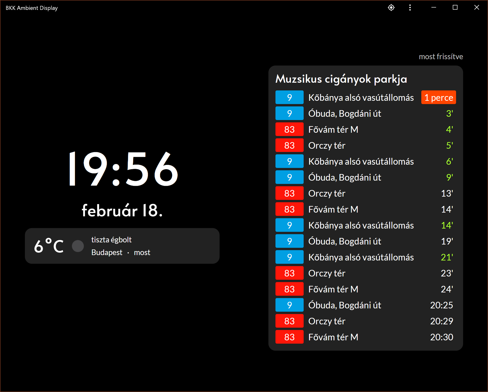

# BKK Ambient Display
Web browser ambient display with the nearest departures of BKK (Budapest public transport company) buses and trams. 

## New
 * Weather conditions for Budapest
 * [PWA](https://developers.google.com/web/progressive-web-apps) support

## BKK departures
 * Shows departures in a fixed radius, directly from BKK Futár real-time service.
 * **Dynamic update interval:** if no departures are foreseable, update timeout increases.

## Weather service
 * Provided by [OpenWeather](https://openweathermap.org)
 * Get your API key at [https://openweathermap.org/api](https://openweathermap.org/api)

## How to install
 1. Clone to your PHP (Apache2) server (or localhost with XAMPP/LAMPP).
 1. Create `back/sensitive.php` and insert:
```
<?php
$weather_api_key = "<your openweather api key>";
?>
```
 1. Open in browser.

## Screenshot


## TODO
 * GUI to customize global parameters (update intervals, etc)
 * Pinnable stops
